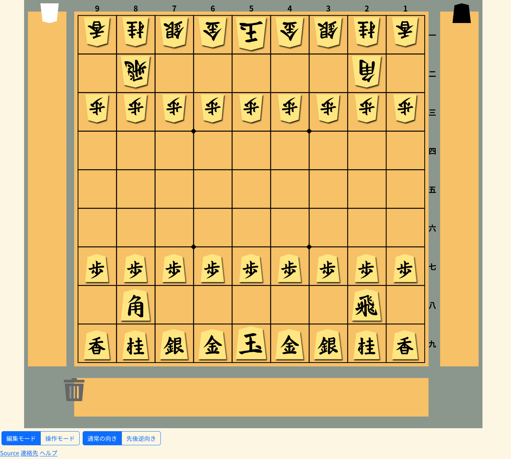

# Expanded-Shogi-Board (ちょっと便利な将棋盤)

Copyright (C) 2023 Hideaki Sakai
See the end of the file for license conditions.
ライセンス条件に関しては、このファイルの最後を見てください。

## 概要
「**ちょっと便利な将棋盤**」は、言葉の通り、実際の将棋盤よりもちょっと便利に使える将棋盤を目指して開発したものです。盤の右側に表示されている、盤と同じ色の縦長の領域が先手の駒台、左側に表示されているのが後手の駒台です。盤の下側または右側に表示されているのが、モードを切り替えるボタンと、盤の向きを切り替えるボタンです。 
[Vue.js](https://ja.vuejs.org/) (TypeScript) と[SVG](https://developer.mozilla.org/ja/docs/Web/SVG)を利用して開発しました。

[GitHub Pages のウェブページ](https://hideboz.github.io/Expanded-Shogi-Board/) でご試用いただけます。



## セットアップ方法
セットアップするには、以下のコマンドを実行してください。

```sh
npm install
```

## 開発用サーバの起動方法
開発用サーバを起動して動作を確認するには、以下のコマンドを実行して、表示されるURLにブラウザからアクセスしてください。

```sh
npm run dev
```

## ビルド方法
ビルドするには、以下のコマンドを実行してください。
`/dist`ディレクトリにビルドされます。

```sh
npm run build
```

## 操作方法

### 基本操作

駒を動かすには、まず動かしたい駒をクリックした後、動かす先をクリックしてください。
「**編集モード**」と「**操作モード**」の切り替えボタンをクリックすると、モードを切り替えることができます。「**通常の向き**」と「**先後逆向き**」の切り替えボタンをクリックすると、将棋盤の向きを逆向きにしたり、戻したりすることができます。

### 編集モード

「**編集モード**」は、盤面を好きなように編集したいときに使うモードです。「**編集モード**」に切り替えると、盤のすぐ下に「使わない駒置き場」が表示されるようになります。駒を盤上で動かすだけでなく、盤、先手と後手の駒台、使わない駒置き場の間で好きに移動することができます。また、盤上の駒を右クリックすると、成りにしたり、駒の向きを先手後手逆にしたり、王と玉を入れ替えたりすることができます。

### 操作モード

「**操作モード**」に切り替えると、「**&DoubleLeftArrow; 戻る**」と「**進む &DoubleRightArrow;**」ボタンが表示されるようになります。「**操作モード**」においては、実際に将棋を指すときと同様に、駒を動かせるのは、盤上で動かすこと、相手の駒を取ること、駒台の駒を打つことのみになります。また、駒が成れる場合は、自動的に成りか不成かを尋ねるメニューが表示されます。「**操作モード**」で駒を動かすと、駒の動きが履歴に保存されて、「**&DoubleLeftArrow; 戻る**」と「**進む &DoubleRightArrow;**」ボタンで履歴を辿ることができます。「**編集モード**」に切り替えると、「**操作モード**」で保存された履歴は削除されlます。

## 謝辞
駒画像は [Shogi Images](https://sunfish-shogi.github.io/shogi-images/) のものを使用させていただきました。

## ライセンス (License)
本ソフトウェアはGNUアフェロ一般公衆ライセンスで公開されています。COPYINGを参照してください。
(This software is released under the GNU Affero General Public License, see COPYING.)


This file is part of Expanded-Shogi-Board.

Expanded-Shogi-Board is free software: you can redistribute it and/or modify
it under the terms of the GNU Affero General Public License as published by
the Free Software Foundation, either version 3 of the License, or
(at your option) any later version.

Expanded-Shogi-Board is distributed in the hope that it will be useful,
but WITHOUT ANY WARRANTY; without even the implied warranty of
MERCHANTABILITY or FITNESS FOR A PARTICULAR PURPOSE.  See the
GNU Affero General Public License for more details.

You should have received a copy of the GNU Affero General Public License
along with Expanded-Shogi-Board.  If not, see <https://www.gnu.org/licenses/>.
